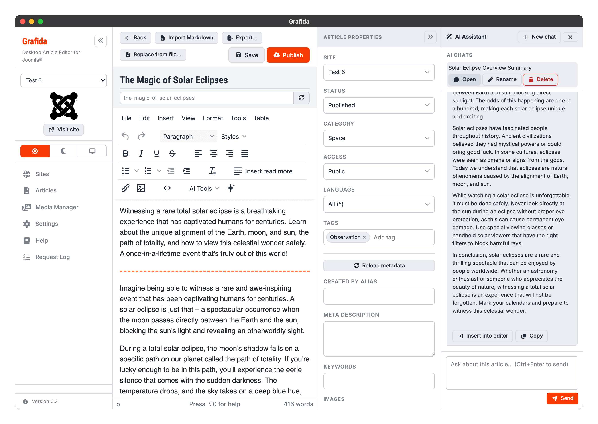

# AI Chat

The assistant panel is docked to the right of the editor. Open it with the sparkle **AI Assistant**
button on the editor toolbar, or by picking anything from the **AI Tools** menu.

Drag the panel's left edge to make it wider or narrower; the width is remembered.

## How a conversation works

The **first** message carries the article — its title and its HTML — as context, so the model knows
what you are talking about. You do not have to paste anything or explain what the article is.

* Picking a **tool** sends that tool's instruction as the first message.
* Picking **Custom…**, or opening the panel with the sparkle button, leaves the chat empty for you
  to type your own.

Type in the box at the bottom and press **Send**, or <kbd>Ctrl</kbd> + <kbd>Enter</kbd>. **Stop**
appears while a reply is arriving and abandons it.

Replies stream in word by word where the provider supports it. A tool's instruction is shown in a
muted **Instructions** block rather than as something you said, so a long prompt does not dominate
the conversation.

If you are using a model that reasons before answering, its scratchpad appears above the reply as a
collapsible **Thinking** block — click to unfold it. It is shown so you can see something is
happening; it is never inserted into the article, sent back to the provider, or saved with the
chat.

## Doing something with a reply

Each reply carries two buttons.

**Insert into editor** puts the reply into the article at the cursor. The reply is converted from
Markdown if necessary, and sanitised, so what lands in your article is clean HTML — no stray
`**bold**` markers, no scripts.

**Copy** copies the reply to the clipboard exactly as the model wrote it, Markdown and all.

> [!TIP]
> Nothing reaches your article until you press **Insert into editor**, and even then it is just an
> ordinary edit: <kbd>Ctrl</kbd>/<kbd>Cmd</kbd> + <kbd>Z</kbd> undoes it.

## The panel header

**New chat** starts a fresh conversation. If the current one is worth keeping, you are offered the
chance to remember it first.

**Close** (the ×) hides the panel, with the same offer.

## Remembering a chat

When you close a non-empty conversation, Grafida asks whether to remember it. If you say yes:

* the local article is saved first, if it was not already;
* a title is generated for the chat if you have not given one;
* the whole conversation is stored alongside the article.

Remembered chats appear in the **AI Chats** banner at the top of the panel, where you can **Open**
one to continue it, **Rename** it, or **Delete** it.

Saved chats travel with the article: they are included in a `.grafida`
[export](Editing-Articles#moving-an-article-between-computers), and they are deleted when the local
article is deleted.

## Full-screen editing

Opening the panel leaves TinyMCE's full-screen mode first — the panel is part of the application's
layout, and a full-screen editor would paint straight over it.

## When something goes wrong

**The buttons are not there.** No AI service is configured, or you configured one while the editor
was already open. Add a service in [Settings](Settings), then go back to the article list and open
the article again.

**The reply arrives all at once and the interface stops responding while it does.** You are using a
local model server without CORS enabled, so Grafida has fallen back to a route that cannot stream.
See [AI Services](AI-Services#using-a-local-model).

**The provider rejects the request as soon as it is sent.** If you switched on *The model can see
images* for a text-only model, switch it back off — such a model rejects the whole request rather
than ignoring the pictures.

**The reply is about the wrong article.** Press **New chat**. The article is attached to the first
message of a conversation, so a chat you carried over from another article still has that one's
text in it.
