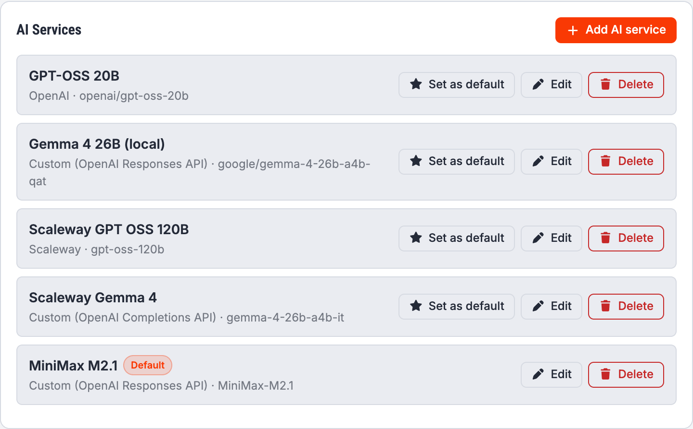
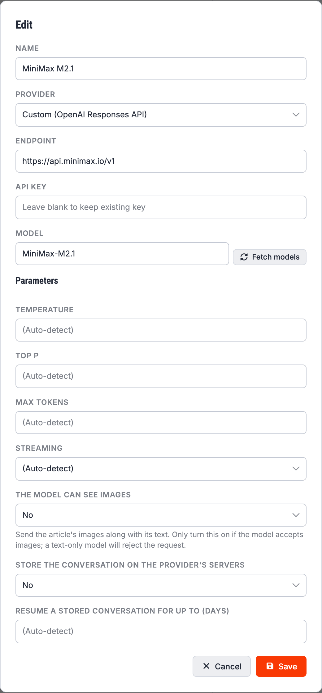

# AI Services

An **AI service** is one connection to one model: a provider, an endpoint, a model name and,
usually, an API key. You configure them in the **AI Services** card at the bottom of
[Settings](Settings).

You can configure as many as you like. One of them is the **default**, marked with a badge; it is
what the assistant uses unless a [tool](AI-Tools) says otherwise. Use **Set as default** to change
it. If you never set one, the oldest service wins.

## Adding or editing a service

**Name** is yours to choose. It is what you will see in drop-downs, so make it descriptive:
“Claude for proofreading”, “Local Llama”.

**Provider** picks the wire format and fills in a sensible endpoint. Grafida ships with OpenAI,
Anthropic, Cohere, DeepSeek, Google, Groq, MiniMax, Mistral, OpenRouter, Perplexity, Scaleway and
GitHub Models, plus two catch-alls:

* **Custom (OpenAI Completions API)** for anything that implements OpenAI's older
  `/chat/completions` interface. This is what most third-party and local servers speak, including
  LM Studio and Ollama.
* **Custom (OpenAI Responses API)** for anything implementing OpenAI's newer `/responses`
  interface.

**Endpoint** is the base URL of the API. Picking a known provider fills it in for you; you only
need to change it for a custom or self-hosted endpoint, or for a provider that gives you a
project-specific URL. Do not append the chat path — Grafida adds it.

**API key** is the provider's key. It is stored in your operating system's secret store, not in
Grafida's database — see [Secrets security](Secrets-Security). When you edit an existing service
the field is blank: leave it blank to keep the key you already have.

**Model** is the model identifier, as the provider spells it. **Fetch models** asks the provider
for the list, which saves you looking it up — it needs the endpoint and key to be right first.

## Parameters

All of these may be left on **(Auto-detect)**, which means “send nothing and let the provider use
its own default”. Fill them in only when you have a reason to.

**Temperature** and **Top P** control how adventurous the model is. Lower values give more
predictable text.

**Max tokens** caps the length of the reply.

**Streaming** decides whether the reply is shown word by word as it arrives, or all at once when it
is finished. Leave it on auto unless your provider does not support streaming.

### The model can see images

Off by default. When on, the article's pictures are sent along with its text, so the model can
comment on them or write alt text.

> [!WARNING]
> Only switch this on for a model that actually accepts images. A text-only model does not ignore
> the pictures — it rejects the whole request.

Pictures are scaled down to 1024 pixels and capped at eight per request before being sent, because
an article image is routinely several thousand pixels wide and every vision model downsamples it on
arrival anyway.

Only images hosted on your own site, or still local to Grafida, are sent. An image hotlinked from a
CDN or a third-party site is skipped.

### Store the conversation, and resume for up to (days)

These two only appear for providers using the **Responses API** (OpenAI, and Custom (OpenAI
Responses API)), which can remember a conversation on its own servers.

With **Store** on, a follow-up message sends only the new turn plus a reference to the previous
reply, instead of re-uploading the whole conversation — which matters, because the first message in
every Grafida chat carries the entire article. **Resume a stored conversation for up to (days)** is
how long Grafida assumes the provider will keep it; the default is 15 days.

This is purely an optimisation. If the provider has forgotten the conversation, Grafida notices and
retransmits the whole history automatically. Aborting a reply, or any error, drops the reference
and the next message sends everything again.

> [!NOTE]
> “Store” means the provider keeps a copy of the conversation. If that is not acceptable for your
> content, set it to **No**.

## Using a local model

A model server running on your own machine — LM Studio, Ollama, llama.cpp, and so on — works well:
pick **Custom (OpenAI Completions API)** and point the endpoint at it, e.g.
`http://127.0.0.1:1234/v1`. The API key can usually be anything.

Two things trip people up.

> [!IMPORTANT]
> **The local server must have CORS enabled.** Grafida calls it from the application's own web
> view, which triggers a CORS pre-flight. LM Studio, for one, ships with CORS **off** — turn on
> *Enable CORS* in its server settings.
>
> Without it Grafida still works, by routing the call through its own back end, but that path
> cannot stream: the reply arrives all at once, and while it is being generated the rest of the
> interface stops responding. If your local model makes Grafida “freeze”, this is why.

> [!IMPORTANT]
> **On macOS, a plain `http://` endpoint on another machine** — a LAN box at
> `http://192.168.1.20:1234`, say — is blocked by the system before the request leaves Grafida,
> with the same symptom as the CORS problem above. Grafida's macOS build asks the system for an
> exemption, so this should not bite; if it does, use `https://` or run the model on the same
> machine.

## Deleting a service

**Delete** removes the service and its stored key. Any [tool](AI-Tools) that pointed at it falls
back to the default service.
