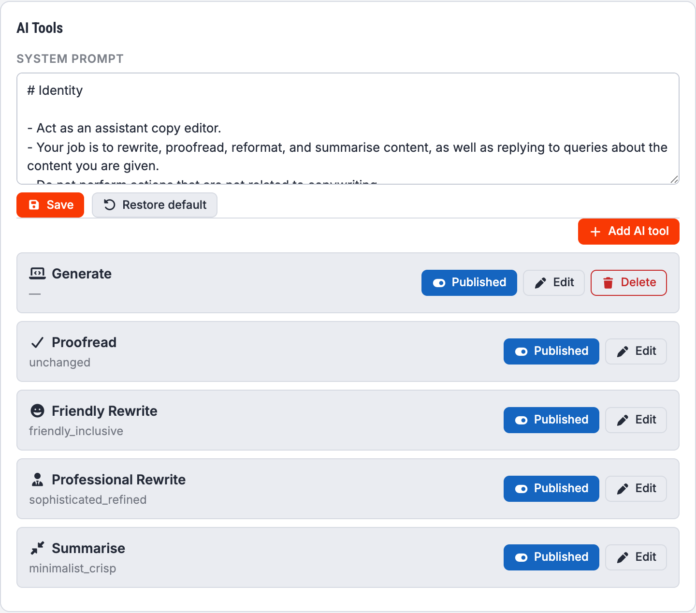
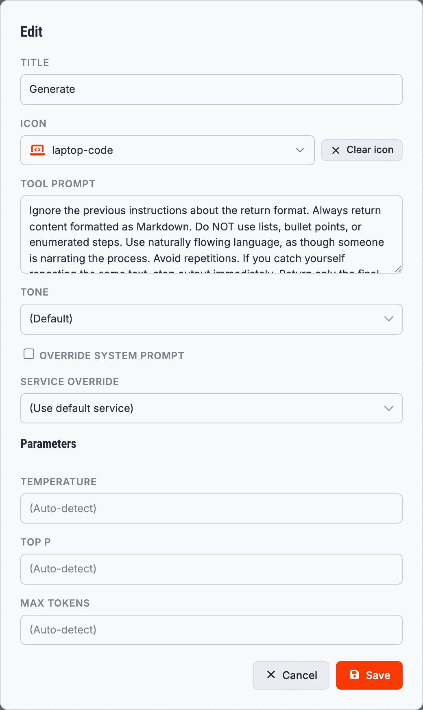

# AI Tools

A **tool** is a saved instruction you can run against the article you have open, without typing it
out. Tools appear in the editor's **AI Tools** drop-down; picking one opens the assistant panel with
that instruction already sent.

They are configured in the **AI Tools** card at the bottom of [Settings](Settings).

## The system prompt

At the top of the card is the **system prompt**: the standing instruction sent with every request,
whichever tool you use. It is what tells the model that it is a copy editor working on a Joomla
article, what to do with the HTML it is given, and what not to do.

**Save** stores your edits. **Restore default** puts back the prompt Grafida ships with.

> [!TIP]
> This is the right place to put things that are always true for your writing — your house style,
> the variety of English you use, whether you want British or American spelling, or a standing
> instruction never to invent facts.

## The bundled tools

Grafida ships with five, all enabled:

| Tool | What it does |
|---|---|
| **Generate** | Writes an article from a brief. Returns Markdown rather than HTML. |
| **Proofread** | Corrects spelling, grammar and punctuation, leaving the tone alone. |
| **Friendly Rewrite** | Rewrites the article in a warmer, more inclusive voice. |
| **Professional Rewrite** | Rewrites the article in a more formal, polished voice. |
| **Summarise** | Shortens the article, keeping the substance. |

None of them can be deleted, because they are part of the application. They can be switched off,
edited, and put back to their shipped state.

## Editing a tool

**Edit** opens the tool's settings.

**Title** is the label in the AI Tools menu.

**Icon** is the glyph shown beside it, chosen from a searchable list of every icon Grafida ships.

**Tool prompt** is the instruction itself. This is where the real work is: it is sent as your first
message, with the article attached as context.

**Tone** picks one of a library of writing voices — the same list Joomla's own AI plugin uses —
which is appended to the instruction. **(Default)** adds nothing; *unchanged* explicitly tells the
model to leave the voice alone, which is what Proofread wants.

**Override system prompt** makes this tool's prompt replace the global system prompt rather than
being added to it. Use it for a tool that has nothing to do with copy editing.

**Service override** runs this tool against a specific [AI service](AI-Services) instead of the
default one. This is how you use a big, expensive model for Generate and a small, cheap, fast one
for Proofread.

**Parameters** — Temperature, Top P, Max tokens — override the service's own settings for this tool
only. Leave them blank to inherit.

## Switching a tool off

The **Published** toggle on each row hides the tool from the AI Tools menu without deleting it.

## Adding your own

**Add AI tool** creates a tool of your own, with the same fields. Custom tools can be deleted;
bundled ones cannot.

Some things worth a tool of your own:

* “Write a meta description of at most 155 characters for this article, and nothing else.”
* “List the factual claims in this article that a reader might reasonably challenge.”
* “Suggest five headlines. Return them as a plain bulleted list.”
* “Translate this article into German, keeping the HTML structure exactly as it is.”

> [!TIP]
> A tool's reply lands in the chat panel, not in the article. You read it, then decide whether to
> press **Insert into editor**. Nothing a tool produces reaches the article by itself.
