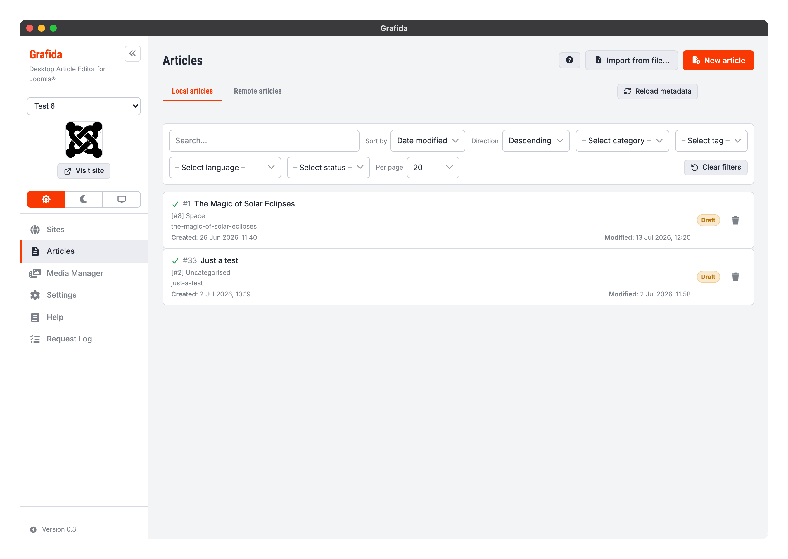
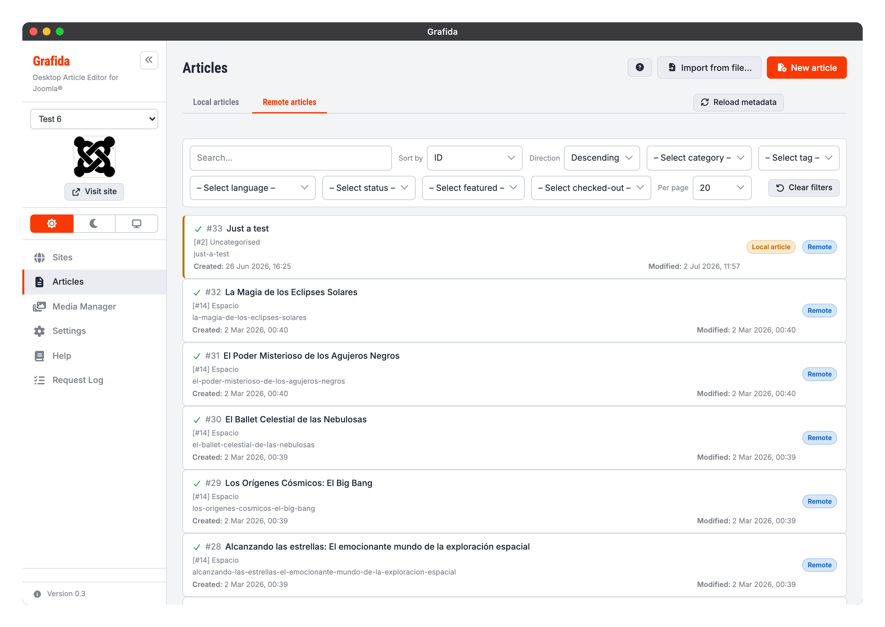

# Articles

The Articles view is where you start and resume your writing. It lists the articles you have on
your computer, and the articles that already exist on the site you have selected in the sidebar.

Everything in this view applies to the **active site**, i.e. the site chosen in the sidebar's
drop-down. Switching sites switches the lists.

## Local and remote articles

Grafida keeps a **local article** — a draft — in its own database on your computer. Nothing is sent
to your site until you press Publish. That is the entire point of the application: you write
off-line, at your own pace, and publish when you are ready.

The view is therefore split into two tabs.

**Local articles** are the drafts stored on your computer. They are listed even when you have no
Internet connection, because reading them needs nothing but Grafida itself.

**Remote articles** are the articles that exist on your site right now. Reading this list needs a
working connection to the site.

The two tabs are not two separate worlds. A local article _remembers_ the remote article it was
created from, so you can open something published on your site, work on it locally over several
days, and publish it back to the same article.

> [!NOTE]
> A draft is only written to Grafida's database the first time you press **Save**. Opening a remote
> article to read it, then going back, leaves nothing behind on your computer.

## The toolbar

**Import from file…** loads a `.grafida` file — an article exported from Grafida, possibly from
another computer — as a new local article on the active site. See
[Editing Articles](Editing-Articles) for what that format holds.

**New article** starts a blank local article on the active site.

> [!TIP]
> <kbd>Ctrl</kbd> + <kbd>N</kbd> (Windows, Linux) or <kbd>Cmd</kbd> + <kbd>N</kbd> (macOS) does the
> same thing from the keyboard, on either tab. It works only in this view — it is deliberately
> inert everywhere else, so it can never interrupt an article you are editing.

**Reload metadata**, next to the tab strip, refreshes the categories, tags, access levels,
languages and custom fields Grafida has cached for this site, and rebuilds the filter drop-downs
from them. Use it after you have added a category or a tag on your site and it is not showing up
here yet. If a filter you had selected no longer exists on the site, it is cleared and Grafida
tells you so.

## Filtering and sorting

Both tabs have the same shape of toolbar: a search box, a sort column and direction, a set of
drop-down filters, and a page-size selector. **Clear filters** resets the lot.

The two tabs filter independently — narrowing the remote list does not narrow the local one — and
each remembers its own settings while the application is running.

The **Local articles** tab searches the title and the alias, and can sort by date modified (the
default, so whatever you touched last is at the top), date created, title, category, language or
status. All of it happens on your computer, so it is instant and works off-line.

The **Remote articles** tab asks your site to do the work, which is why it offers everything
Joomla's own article list does: sorting by ID, filtering by featured state and by checked-out
state, and page-by-page navigation through what may be thousands of articles.

> [!TIP]
> The **Remote articles** tab does not offer an author filter, and the **Local articles** tab does
> not offer sorting by ID. Neither is an oversight: Grafida has no list of your site's users, and a
> local article only acquires a Joomla ID once you have published it, so half the list would sort
> by a value the other half does not have.

## Reading a row

Each row tells you the same things in both tabs.

The **icon** on the left is the article's publishing status, using Joomla's own colours: a green
tick for published, a red cross for unpublished, a blue box for archived, and a muted bin for
trashed.

The **`#123`** next to the title is the article's ID _on your Joomla site_. A local article that
has never been published does not have one yet, so it shows none.

Below the title you see the **category** (with its own ID), the **alias** — the last part of the
article's URL — and the dates the article was **created** and last **modified**. On a local
article those dates describe your local copy, not the article on the site.

On the right-hand side is a badge saying whether the row is a **Draft** (local) or **Remote**.

A remote article you already have a local copy of stays in the remote list, with an extra
**Local article** badge and a coloured edge. Clicking it opens your local copy rather than
downloading the article again and throwing your work away.

## Opening, creating and deleting

Click any row to open it in the [editor](Editing-Articles).

* A **local article** opens directly.
* A **remote article** you have no local copy of is downloaded and opened as a new, unsaved local
  article.
* A **remote article** you already have a local copy of opens that copy.

Local rows carry a bin button to delete the local copy.

> [!CAUTION]
> Deleting a local article deletes it, its saved AI chats and any images you had pasted into it but
> not yet published. It does **not** delete anything on your site. There is no undo.
