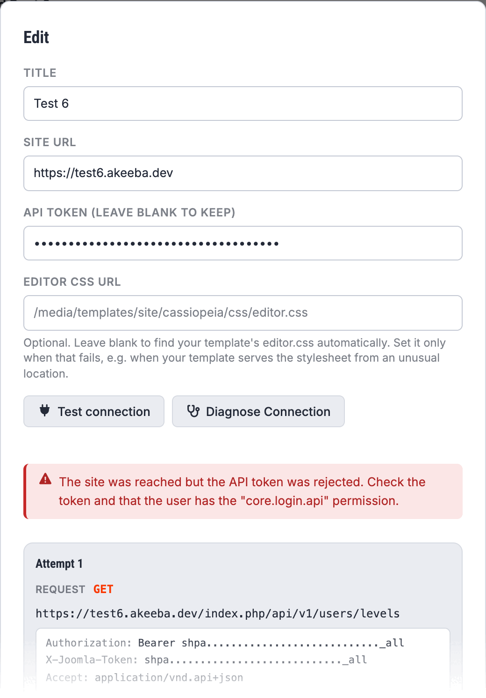

# Connection Troubleshooting

When **Test connection** on a site's edit dialog fails, the message tells you what went wrong, but
not always why. **Diagnose Connection**, the button next to it, shows you the whole conversation
Grafida tried to have with your site.



> [!IMPORTANT]
> Both buttons need an API token in the dialog. Editing an existing site shows the token field
> blank on purpose — Grafida never shows a stored token back to you — so **re-enter your token**
> before pressing either button.

## What Diagnose Connection does

Joomla's Web Services API can live at more than one URL, depending on whether your server has URL
rewriting enabled and how it is configured. Grafida therefore does not guess: it tries each
possibility in turn, asking for a harmless resource (the list of view access levels), and uses the
first one that answers like a Joomla API.

Given a site URL of `https://www.example.com`, the candidates are, in order:

1. `https://www.example.com/index.php/api`
2. `https://www.example.com/api/index.php`
3. `https://www.example.com/api`

The first is tried first because it works without any URL rewriting and is therefore the most
reliable. The last one needs rewriting to be enabled and configured for the API application.

**Test connection** reports only the verdict. **Diagnose Connection** reports every attempt: the
full request, its headers, the status that came back, and the response body. Your API token is
masked in all of it, exactly as it is in the [Request Log](Request-Log).

## Reading the result

### “The site was reached but the API token was rejected”

Your site answered, and answered as a Joomla API — the URL is right. The problem is the token or
the account behind it.

* Check that you copied the **whole** token, with no leading or trailing space. Joomla's tokens can
  end in one or two equals signs (`=`); a double-click selection often stops just short of them,
  and a token missing its tail looks exactly like a wrong token.
* Check that the token is still **Active** on your Joomla user's profile. Saving the profile with
  Active set to No, then back to Yes, mints a *new* token; the old one stops working.
* Check that the plugins listed in [Connect a Site](Connect-a-Site) are all published — in
  particular **API Authentication - Web Services Joomla Token**.
* Check that the user account itself is not **blocked**.
* If the account is not a Super User, it needs the **Web Services Login** permission. See
  [Custom API access](Custom-API-Access).

Two less obvious causes, both of which invalidate a token that used to work:

**The site's secret key changed.** Restoring a backup onto a different site, moving a site between
domains, or editing `$secret` in `configuration.php` invalidates every API token on the site. Mint
a new one and paste it into Grafida.

**The whole site is behind HTTP Basic Authentication.** The browser password prompt some people put
in front of a staging site uses the same `Authorization` header the Joomla API token travels in, so
the two collide and Joomla never sees the token. Either lift the password protection, or exempt the
API application from it. For Apache:

```apache
SetEnvIf Request_URI "^/api/*" pleaseletmein
Order allow,deny
Allow from env=pleaseletmein
Satisfy any
```

### “Could not find a working Joomla Web Services API endpoint at this URL”

Grafida reached your server — so it is online, the host name resolves, and TLS worked — but none of
the three candidate URLs answered the way a Joomla API answers.

> [!NOTE]
> The message is deliberately plain, and it is not wrong: from where Grafida is standing there is no
> *working* API endpoint. It does not, however, tell you **why**, and there are several very
> different reasons. **The answer is almost always visible in the Diagnose Connection output** — so
> look at the attempts before you start changing settings.

What to look at, in the diagnostic panel, for each of the three attempts: the **status code**, and
whether the response body is JSON or an HTML page. Those two together identify the cause.

#### 404 on all three attempts — routing or configuration

This is the ordinary case: the API application is not where Grafida looked.

* Check the **Site URL**. It must be the site's base URL, with no `/administrator`, no
  `/index.php` and no `/api` suffix. Grafida strips those if you paste them, but a wrong path
  further up cannot be guessed.
* On a **multi-language site**, do not include the language code. `https://www.example.com/en` is
  wrong; `https://www.example.com` is right.
* Check that the **Web Services** plugins are published. With them all disabled the API application
  exists but exposes nothing.
* Look for an **`.htaccess` file inside the site's `api/` directory**. Some hosts and some security
  recipes drop one in to block the folder. Remove it.
* Look for a **menu item whose alias is `api`**. It shadows the API application and makes the whole
  thing 404. Rename it — and empty the trash, because a trashed menu item still holds its alias.
* If none of that applies, consider **missing or corrupt core files**. Joomla can put them back:
  System ▸ Update ▸ Joomla, then **Reinstall Joomla core files**.

#### An HTML page where JSON should be — usually a broken third-party plugin

If a candidate answered `200` but the body is HTML, or JSON with warnings and notices printed above
it, the API application is running but something is corrupting its output. In practice this is
nearly always a third-party **plugin**.

Joomla 4 and later have five separate applications — site, administrator, API, CLI and installation
— and a plugin written as though only the first two exist will break the API. The usual mistakes are
running logic in the plugin's constructor, calling `Factory::getDocument()` (which forces an HTML
document before Joomla has decided the output format), calling HTML-only methods such as
`addScript()`, and gating code on `isClient('administrator')` — which does **not** exclude the API
application. Nicholas Dionysopoulos wrote the whole thing up in
[Common mistakes writing Joomla plugins](https://www.dionysopoulos.me/common-mistakes-writing-joomla-plugins.html);
that is the link to send the plugin's developer.

To find the culprit, bisect:

1. In the site's back end, go to System ▸ Manage ▸ Plugins.
2. Disable the **third-party** plugins — leave Joomla's own alone — starting with the `system`,
   `content`, `actionlog` and `behaviour` groups, which is where this almost always lives.
3. Press **Test connection** in Grafida after each one.
4. When the connection succeeds, you have found it. Re-enable everything else.
5. Report it to that plugin's developer with the article above. It is a real bug in the plugin, not
   a Grafida or Joomla problem, and it will be breaking every other API client too.

An HTML body can also be a **maintenance/offline page**, or a security extension's own block page —
see the next case.

#### An unexpected status code — the host, a firewall, or a rate limiter

A `403`, `429`, `503` or any `5xx`, usually with an HTML body, means something in front of Joomla
answered instead of Joomla.

> [!IMPORTANT]
> **Grafida fires its three candidate requests in quick succession**, which is exactly the pattern a
> rate limiter is built to catch. A site that works perfectly in a browser can still refuse
> Grafida's probe. This is a real, reported case
> ([issue #46](https://github.com/akeeba/grafida/issues/46)): a host's WAF answered all three probes
> with `429` and its own HTML page, and the generic "no endpoint" message sent the user looking at
> the URL when the URL was fine all along.

Candidates, roughly in order of likelihood:

* Your host's **WAF or rate limiter** — o2switch's "Tiger Protect", Imunify360, `mod_security2` and
  similar. A `403` or `429` with an HTML body is the signature.
* A **CDN or proxy** in front of the site — Cloudflare, Sucuri — with a security rule or a
  bot-fighting mode enabled.
* A **security extension** on the site itself, or a hand-written `.htaccess` rule.
* **Admin Tools Professional's automatic IP blocking**, if you tried a wrong token a few times. Its
  block is a plain `403` with an HTML page, so it lands here rather than in the "token rejected"
  case above. Clear it in Components ▸ Admin Tools ▸ Web Application Firewall ▸ **Auto Blocked IP
  Addresses**.

> [!TIP]
> Grafida runs on **your computer**, not on a server, so the address to unblock or whitelist is your
> own public IP — not a fixed one belonging to the application. If you work from a laptop on
> different networks, expect to do this more than once, and prefer relaxing the rule to whitelisting
> a single address. Grafida sends no distinctive `User-Agent` on its API requests, so your IP
> address is what identifies you to your host's support.

### A network or connection error

Grafida could not reach your server at all. This is reported differently from the cases above on
purpose, because the fix is elsewhere.

* Check that you are online, and that the site loads in a browser on this computer.
* Check for a typo in the host name.
* A **TLS/certificate** failure is reported as its own kind of error, not as “check your Internet
  connection”. It usually means an expired certificate, an incomplete certificate chain, or a
  self-signed certificate on a development site.
* A corporate proxy, a VPN or a firewall may be blocking the request even though your browser gets
  through — browsers are often configured separately.

## Things that look like connection problems but are not

**“Access denied” when publishing.** The connection is fine; Joomla is refusing the operation. A
non-Super-User account is limited by its own user groups: an Author, for instance, cannot change an
article's publishing state or edit an already-published article. See
[Custom API access](Custom-API-Access).

**Categories or tags are missing or out of date.** Grafida is drawing them from its local copy.
Press **Reload metadata** — on the Sites view, on the Articles view, or in the editor's properties
sidebar. See [Settings](Settings#site-metadata) for how often that copy refreshes by itself.

**The article list is empty but the site is fine.** Check the filters on the
[Articles](Articles#filtering-and-sorting) view, and press **Clear filters**.

**The editor's text looks wrong — wrong font, wrong colours.** That is your site's `editor.css`,
which Grafida deliberately loads so that what you see matches your site. See
[Sites](Sites#adding-or-editing-a-site) for the Editor CSS URL field and
[Navigation](Navigation#colour-scheme-controls) for how it interacts with dark mode.

## Digging deeper

Diagnose Connection only covers the endpoint probe. If the site connects but something specific goes
wrong later — a publish that fails, an image that does not upload — switch on the
[Request Log](Request-Log) under **Debug** in [Settings](Settings#debug), reproduce the problem, and
look at what was actually sent and returned.

If you are troubleshooting a Joomla site's Web Services API in general, the
[Panopticon connection troubleshooting guide](https://github.com/akeeba/panopticon/wiki/Connection-Troubleshooting)
covers much of the same ground from the other side of the wire. Panopticon is a server watching your
site rather than a desktop application, so the network advice differs — but the site-side causes are
identical, because both use the same API.

When you report a problem on the
[issue tracker](https://github.com/akeeba/grafida/issues), an exported diagnostic or request log is
by far the most useful thing you can attach. Read it first: it is redacted, but it still describes
your site.
