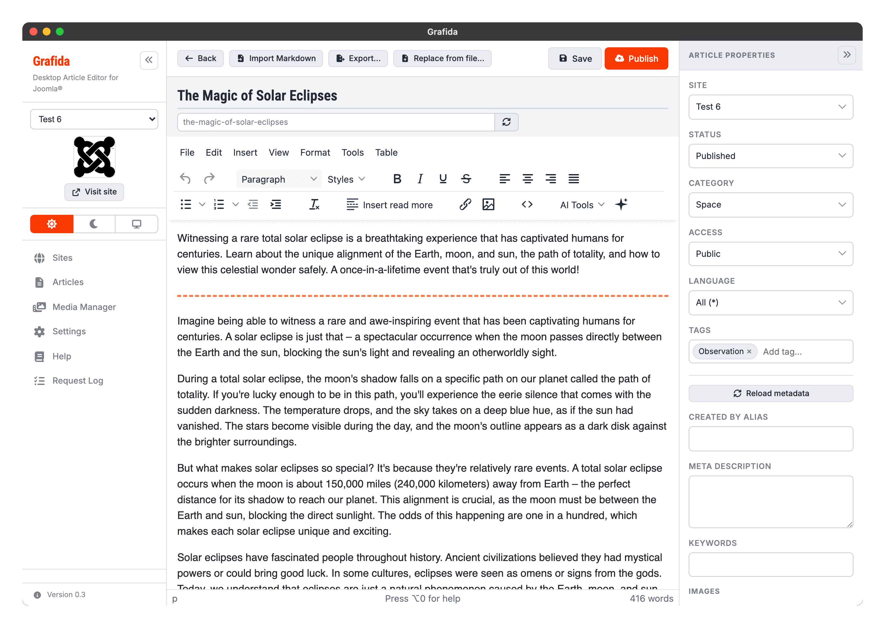
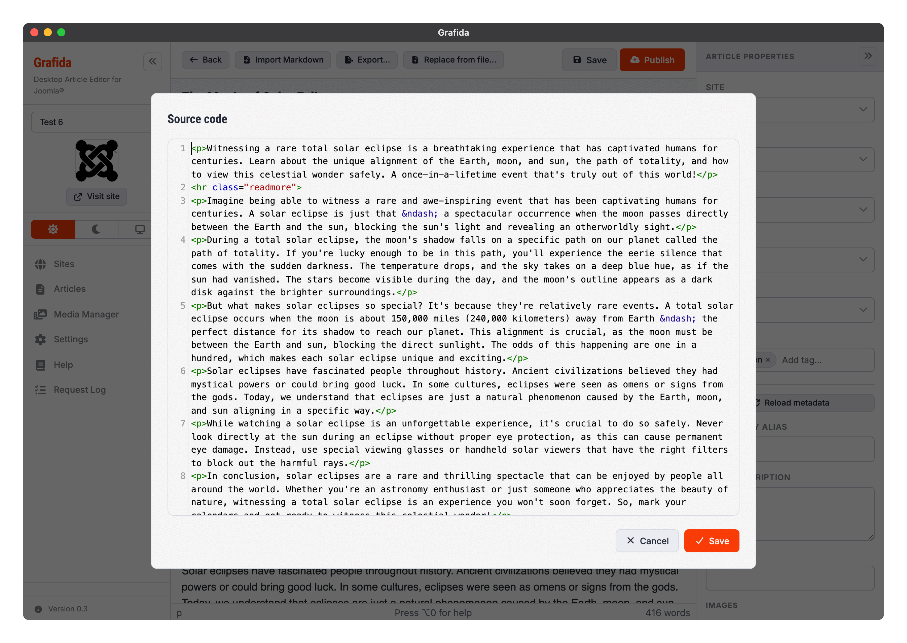
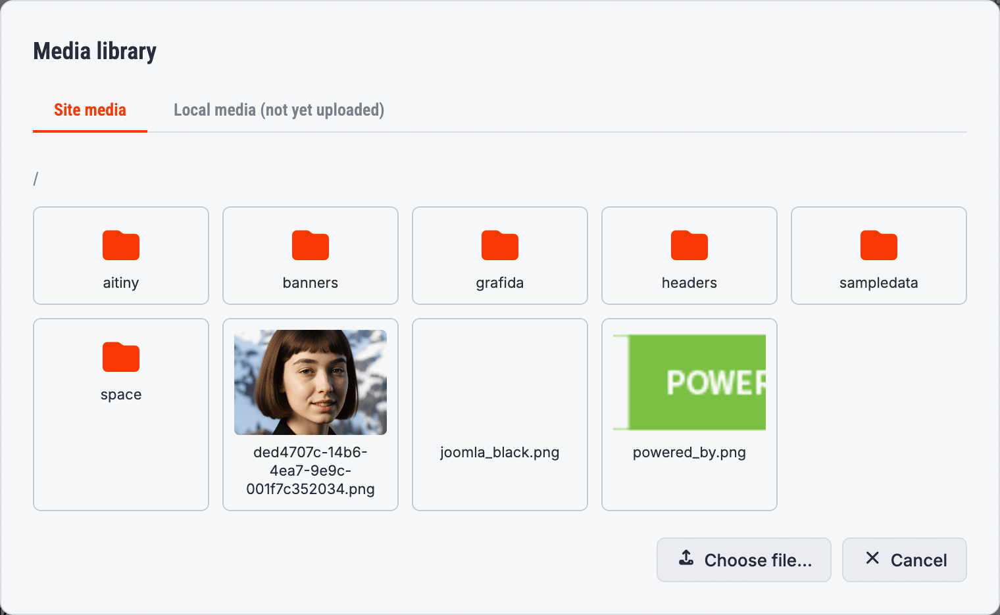
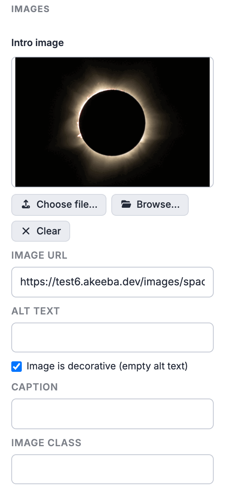

# Editing Articles

The editor is where you spend most of your time in Grafida. It opens when you click any row in the
[Articles](Articles) view, or when you press **New article**.

The screen has three parts: the **toolbar** across the top, the **editor** itself in the middle,
and the **Article properties** sidebar on the right. The properties sidebar can be collapsed with
the `»` button in its header when you want the full width for writing.

## The toolbar

**Back** returns to the Articles view. If you have unsaved changes you are offered the chance to
save them first.

**Import Markdown** replaces the article body with a Markdown file converted to HTML. This is meant
for the case where you drafted something in a Markdown editor and want to finish it in Grafida.

**Export…** writes the whole local article to a `.grafida` file — see
[Moving an article between computers](#moving-an-article-between-computers) below.

**Replace from file…** does the opposite: it overwrites the article you have open with the contents
of a `.grafida` file, while keeping its link to the site and to the remote article. You are asked
to confirm, and the article is saved before it is overwritten.

**Save** stores the article in Grafida's local database. Nothing is sent to your site.

**Publish** sends the article to your site. See [Publishing](#publishing) below.

> [!TIP]
> <kbd>Ctrl</kbd> + <kbd>S</kbd> (Windows, Linux) or <kbd>Cmd</kbd> + <kbd>S</kbd> (macOS) saves
> the local article from anywhere in the editor.

## Title and alias

The large field at the top is the article **title**. Below it is the **alias**: the last part of
the article's URL on your site.

Leave the alias empty and Grafida fills it in from the title when you move focus out of the title
field. It never overwrites an alias you typed yourself; use the circular-arrows button next to the
field to regenerate it deliberately.

The alias Grafida shows is a faithful preview of what Joomla will produce, including the
site-specific difference: on a site with **Unicode aliases** switched on in Global Configuration, a
Greek title yields a Greek alias, while a site using the default transliterating behaviour turns
the same title into Latin characters — or, if nothing survives, into a date-and-time stamp.

## Writing

The editing area is TinyMCE, the same editor Joomla ships with, so the menus and the toolbar will
be familiar. A few things are specific to Grafida.

### Styles

The **Styles** drop-down applies a CSS class to your selection, exactly as Joomla's editor does.
The list of classes is read from your site's `editor.css`, so what you see here is what your own
template offers, plus a small set of common fall-backs.

Select some text and pick a style and the selection is wrapped in a `` carrying that class.
Put the cursor in a paragraph without selecting anything and the class is applied to the whole
paragraph instead.

### Read more

**Insert read more** puts Joomla's read-more separator at the cursor. Everything above it becomes
the article's *intro text* — what Joomla shows in blog and category listings — and everything below
it becomes the *full text*.

You can only have one separator per article, which is also Joomla's rule.

### Slash commands

Type `/` on an empty line and a filterable menu of common insertions appears: headings, lists,
dummy text, a quotation, the read-more separator, images, a link, a table, the source code editor
and full-screen mode. Keep typing to filter, press <kbd>Enter</kbd> to insert the highlighted item.

The filter matches the English keyword as well as the translated label, so `/head` finds the
headings even when you are running Grafida in another language.

This is switched on by default; you can turn it off in [Settings](Settings).

### Spell checking

Grafida uses your operating system's own spell checker, so misspellings are underlined as you type
and suggestions come from the dictionaries your computer already has.

Suggestions appear in the **native** context menu, which you reach with <kbd>Ctrl</kbd> +
right-click (Windows, Linux) or <kbd>Cmd</kbd> + right-click (macOS) — a plain right-click opens
the editor's own menu instead.

> [!IMPORTANT]
> **The spell-check language is an operating system setting; Grafida cannot override it.** On macOS
> it lives in System Settings ▸ Keyboard ▸ Text Input ▸ Spelling. If it is pinned to one language,
> text in any other language is flagged wholesale; if it is set to “Automatic by Language”, only
> the languages enabled in that list are detected. Windows and Linux likewise defer to their own
> spell-check configuration.

Spell checking can be turned off in [Settings](Settings). Turning it back on only marks text you
edit afterwards, not the text already on screen — that is a limitation of the underlying web view.

### The source code editor

The `<>` toolbar button (also in the Tools menu, and in the slash-command menu) opens the article's
HTML in a proper code editor with syntax highlighting, bracket matching and search and replace.

| Action | Windows / Linux | macOS |
|---|---|---|
| Find | <kbd>Ctrl</kbd> + <kbd>F</kbd> | <kbd>Cmd</kbd> + <kbd>F</kbd> |
| Find next | <kbd>Ctrl</kbd> + <kbd>G</kbd> | <kbd>Cmd</kbd> + <kbd>G</kbd> |
| Find previous | <kbd>Shift</kbd> + <kbd>Ctrl</kbd> + <kbd>G</kbd> | <kbd>Shift</kbd> + <kbd>Cmd</kbd> + <kbd>G</kbd> |
| Replace | <kbd>Ctrl</kbd> + <kbd>Shift</kbd> + <kbd>F</kbd> | <kbd>Cmd</kbd> + <kbd>Alt</kbd> + <kbd>F</kbd> |
| Jump to line | <kbd>Alt</kbd> + <kbd>G</kbd> | <kbd>Alt</kbd> + <kbd>G</kbd> |

Saving the source code applies the whole change as a single undo step, so one <kbd>Ctrl</kbd> +
<kbd>Z</kbd> in the editor takes you back to where you were.

How much the editor closes tags for you is a [Settings](Settings) option with three choices,
because the two halves of the feature are useful separately: finishing `
` can insert `
` for
you, and typing `</` can complete the closing tag of whatever is open. See
[Settings](Settings#close-html-tags-for-me).

### Keyboard shortcuts

Beyond TinyMCE's own shortcuts, Grafida adds a few. They are also listed in the editor's own
**Help** dialog (Tools ▸ Help), on its **Grafida** tab.

| Action | Windows / Linux | macOS |
|---|---|---|
| Save the local article | <kbd>Ctrl</kbd> + <kbd>S</kbd> | <kbd>Cmd</kbd> + <kbd>S</kbd> |
| Open Settings | <kbd>Ctrl</kbd> + <kbd>,</kbd> | <kbd>Cmd</kbd> + <kbd>,</kbd> |
| Inline code format | <kbd>Ctrl</kbd> + <kbd>Shift</kbd> + <kbd>C</kbd> | <kbd>Ctrl</kbd> + <kbd>Shift</kbd> + <kbd>C</kbd> |
| Preformatted block | <kbd>Ctrl</kbd> + <kbd>Shift</kbd> + <kbd>P</kbd> | <kbd>Ctrl</kbd> + <kbd>Shift</kbd> + <kbd>P</kbd> |
| Blockquote block | <kbd>Ctrl</kbd> + <kbd>Shift</kbd> + <kbd>Q</kbd> | <kbd>Ctrl</kbd> + <kbd>Shift</kbd> + <kbd>Q</kbd> |

## Images in the article body

There are four ways to get a picture into the article body.

* **Paste or drag** it straight into the editor.
* **Insert ▸ Image**, then the browse button next to the Source field, and pick from your site's
  Media Manager.
* The same browse button's **Local media** tab, to reuse a picture you have already put into some
  other article but not published yet.
* The same browse button's **Choose file…** button, to pick a file from your computer.

A picture that is not yet on your site is kept **inside Grafida** until you publish. It is not
uploaded when you insert it, and it is not embedded in the article's HTML either — so pasting a
handful of screenshots does not turn your article into a multi-megabyte blob. On publish, every
such picture is uploaded to your site's Media Manager and the article is rewritten to point at the
uploaded copies.

Select an image in the article — or right-click it — and you get four extra actions:

* **Image** re-opens the Insert/Edit Image dialog (dimensions, description, alignment, and an
  *Image is decorative* checkbox that empties the alt text so screen readers skip it).
* **CSS class…** sets any CSS class on the image; the Insert/Edit Image dialog has no field for it.
* **Edit image** opens Grafida's crop / resize / rotate / flip editor on the picture itself. It is
  only available for a picture that is still local to Grafida.
* **Reset size** restores the image's `width` and `height` to the picture's real dimensions.

> [!TIP]
> The right-click menu is the reliable route. The floating toolbar only appears once the image is
> *selected*, and right-clicking an unselected image selects nothing.

## Article properties

The sidebar on the right carries everything Joomla asks about an article other than its text.

**Site** is the site this local article belongs to. Changing it moves the article to another site;
if it was linked to an article on the old site, that link is broken — Grafida warns you first.

**Status** is the state the article will be given when published: Published, Unpublished, Archived
or Trashed. It is independent of the Publish button, which is a *push*, not a state change.

**Category**, **Access**, **Language** and **Tags** come from your site. Categories are shown as a
tree, with the same `- ` indentation Joomla uses. The Tags field accepts existing tags and new
ones.

**Reload metadata** re-reads all of the above from the site. Your unsaved edits are preserved.

**Custom Fields** appear next, if your site has any that apply to articles. Just as in Joomla, you
only see the fields the article's **category** uses — a field assigned to that category, to one of
its parent categories, or to no category at all. Change the Category and the list changes with it;
anything you had already typed into a field that belongs to another category is kept, so switching
back and forth loses nothing. An article with no category set sees every field.

**Created by Alias** is the by-line Joomla shows instead of the publishing account's name. Leave it
empty to credit the account whose API token you are using.

**Meta Description** and **Keywords** are the article's SEO metadata.

**Images** — at the bottom — holds Joomla's *Intro image* and *Full article image*. For each one you
can pick a file from your computer, browse your site's Media Manager, or paste a URL, and set its
alt text, caption and CSS class. The *Image is decorative* checkbox empties the alt text and marks
the picture so a screen reader skips it.

The *Full article image* block below it is identical.

### Custom fields Grafida cannot edit

Grafida edits the common core field types: calendar, checkboxes, colour, integer, list, radio,
text, textarea and URL. Anything else — editor, media, SQL, subform, user, user group list, image
list — is listed as unsupported below the fields it can edit. Like the editable fields, this list
only covers the article's own category.

> [!WARNING]
> If one of those unsupported fields is **required** for the article's category, Grafida refuses to
> publish the article rather than sending Joomla something it will reject. Either put the article in
> a category that does not use that field, or edit it in the Joomla back-end instead.

## Publishing

**Publish** sends the article to your site. In order, Grafida:

1. uploads every picture in the article that is still local to Grafida, into the `grafida` folder
   of your site's Media Manager, and rewrites the article to point at the uploaded copies;
2. splits the article at the read-more separator into Joomla's intro text and full text;
3. creates any tags that do not exist yet;
4. creates the article, or updates the existing one if this local article is linked to one.

Every write records a note in Joomla's own version history saying it was made with Grafida and
which version, so an editor looking at the article's history on the site can see where a revision
came from.

Afterwards, Grafida asks what to do with your local copy:

* **Delete Local Article** removes it from your computer and takes you back to the list. The
  article remains on your site, and shows up in the Remote articles tab.
* **Keep Local Article** leaves the editor open so you can keep working and publish again.

> [!NOTE]
> Publishing does not change the article's status on your site by itself. The **Status** field in
> the properties sidebar is what decides whether the article ends up published or not.

## Moving an article between computers

**Export…** writes the article to a `.grafida` file: a single, plain-JSON file holding every field
you can see, the saved AI chats, and any pictures you have used but not yet published. It
deliberately does *not* carry the site it belonged to, or the ID of the remote article it mirrored
— those mean nothing on another installation.

Because the underlying window toolkit has no “Save as” dialog, Grafida asks you for a **folder**
and names the file after the article's alias.

There are two ways back in:

* **Import from file…** in the [Articles](Articles) view creates a brand-new local article on the
  active site.
* **Replace from file…** in the editor overwrites the article you have open, keeping its link to
  the site and to the remote article.
