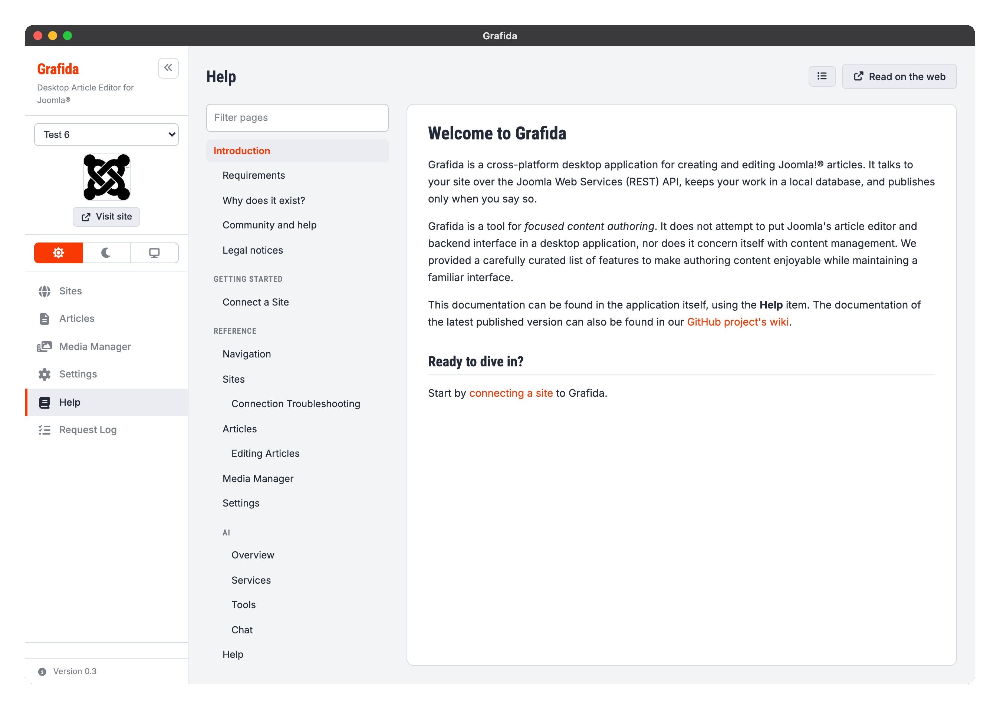

# Help

The Help view is this documentation, built into the application.

It needs no Internet connection, no configured site and no API token: the pages ship inside
Grafida itself. That is deliberate — the moment you most need the manual is usually the moment
nothing else is working yet.

## Getting around

The left-hand pane is the table of contents. The **Filter pages** box at the top of it narrows the
list as you type; a section stays visible when any page inside it matches, so you never lose the
route to a page you can see.

The `☰` button in the header hides the contents pane altogether, which is worth knowing on a small
screen. You can also drag the divider between the two panes to give one of them more room. Both the
width and whether the pane is hidden are remembered.

Grafida comes back to the page you were reading when you leave the Help view and return to it.

**Read on the web** opens the page you are reading in your normal browser, on the project's GitHub
wiki. The wiki is the same documentation, for the **latest released version** — which is the point
of the button: if you are on an older release, that is how you check whether something has changed
since.

## Help buttons on other screens

Every screen reachable from the sidebar carries a small **?** button next to its own actions. It
opens the Help view directly on that screen's page, so you do not have to go looking.

## About this documentation

The documentation is **English only**, even when you are running Grafida in another language. It is
a single source shared with the project's GitHub wiki, which has a flat page namespace with nowhere
to put a translated set. The Help view's own buttons and labels are translated.

The pages you are reading are a snapshot taken when your copy of Grafida was built. They describe
the version you are running, which is what you want when something behaves unexpectedly.

Corrections and additions are welcome on the
[issue tracker](https://github.com/akeeba/grafida/issues) — see
[Community and help](Community-and-help).
