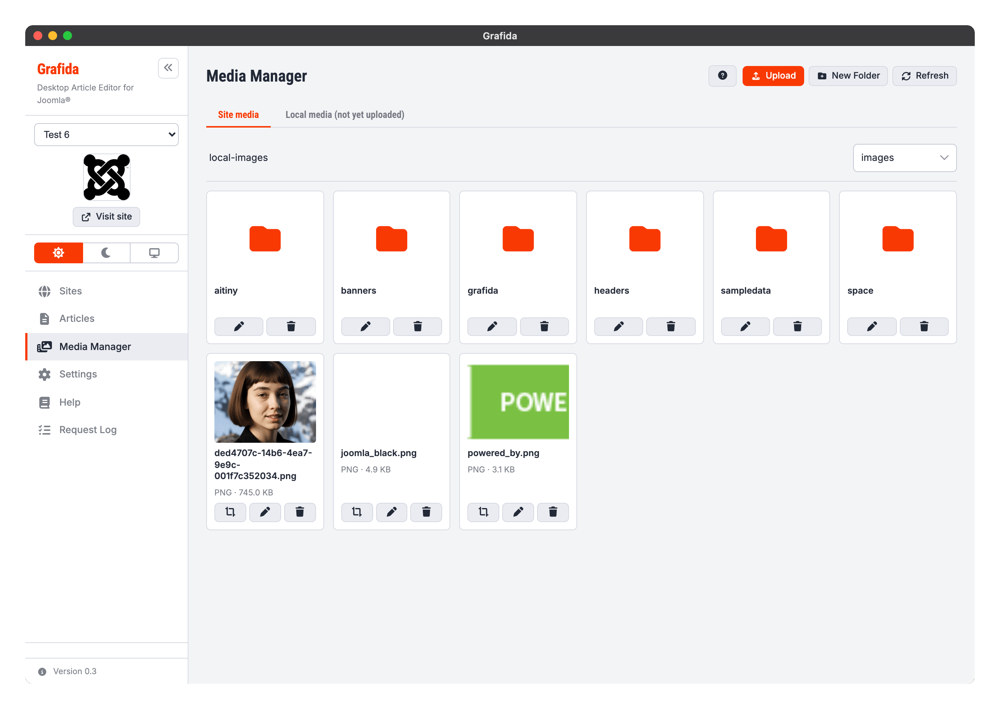
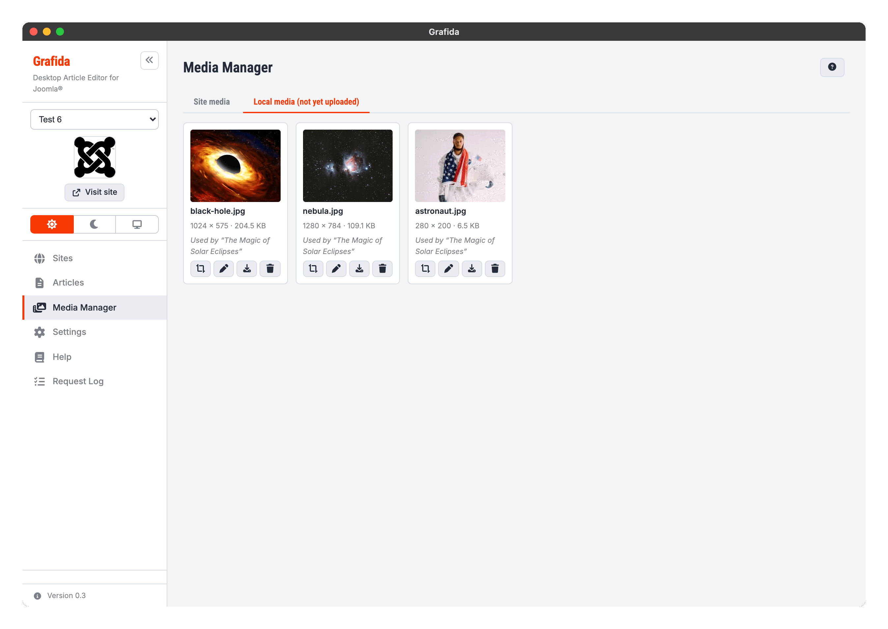
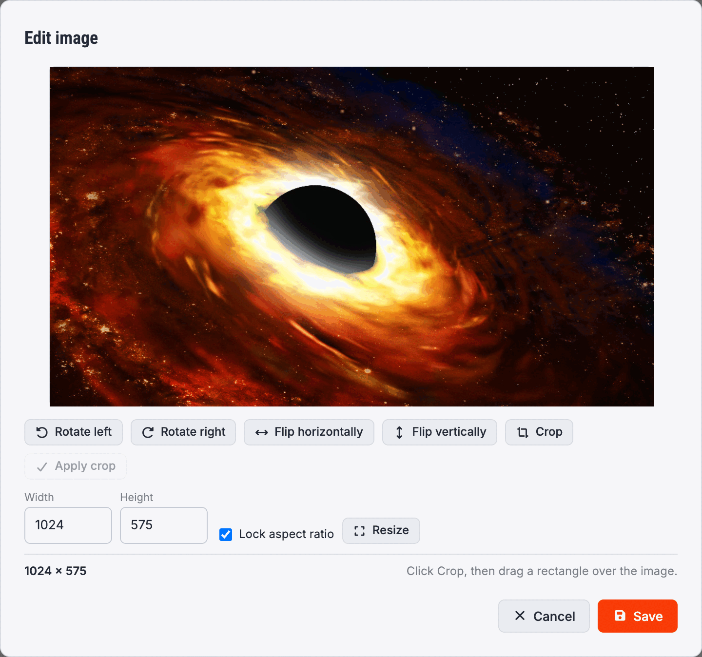

# Media Manager

The Media Manager view lets you work with the pictures and files belonging to the site selected in
the sidebar, and with the pictures that are still only on your computer.

Like the [Articles](Articles) view, it has two tabs.

## Site media

**Site media** is your Joomla site's own Media Manager, seen from Grafida. It shows the same
folders and files an administrator sees in the site's back end, and it needs a working connection.

Click a folder to go into it; the path above the grid is a breadcrumb you can click to come back
out. If your site has more than one media filesystem configured, a drop-down on the right lets you
switch between them.

The header buttons act on the folder you are looking at.

**Upload** picks a file from your computer and uploads it here.

**New Folder** creates a folder here.

**Refresh** re-reads the folder from the site.

Each card carries its own actions:

* **Edit image** (the crop icon) opens Grafida's [image editor](#the-image-editor). It appears only
  on picture formats that can be edited — PNG, JPEG and WebP.
* **Rename** (the pencil) renames the file or folder. It stays where it is; you are only changing
  its name.
* **Delete** (the bin) removes it from your site.

> [!CAUTION]
> Uploading, renaming and deleting here act on your **live site**, immediately. There is no local
> staging step and no undo.

## Local media (not yet uploaded)

**Local media** lists the pictures that live inside Grafida: everything you have pasted, dropped
or picked into an article on this site and not yet published.

This tab reads nothing but Grafida's own database, so it **works with the site unreachable** — the
Site media tab next to it may well be showing an error at the same time.

Each card shows the file name, the picture's dimensions and size, and the local article that uses
it. A picture that has already been published to the site is marked **Published**.

The actions are:

* **Edit image** (the crop icon) — see below.
* **Rename** (the pencil).
* **Save to disk** (the download arrow) writes a copy to a folder you choose.
* **Delete** (the bin) removes the picture from Grafida.

> [!WARNING]
> Deleting a local picture that is still used by a local article leaves a broken image in that
> article — Grafida warns you and names the article. It is worse than cosmetic: an article that
> references a picture Grafida no longer has cannot be published at all until you remove or replace
> the image.

Publishing an article uploads every local picture it uses to your site's Media Manager, into a
`grafida` folder in your site's images filesystem. Both the filesystem and the folder are settings
of the site — see **Upload images to** and **Upload folder** in [Sites](Sites).

## The image editor

Both tabs — and the **Edit image** action on a picture inside an article — open the same editor.

**Rotate left** and **Rotate right** turn the picture a quarter turn. **Flip horizontally** and
**Flip vertically** mirror it.

**Resize** changes the picture's pixel dimensions. Lock the aspect ratio and typing one dimension
fills in the other.

**Crop** is a _mode_, not a one-shot action. Press it and the picture dims with an instruction to
drag a rectangle over the area you want to keep; the button turns into **Cancel crop** while it is
armed. Drag out a rectangle — the readout shows its size in the picture's own pixels — then press
**Apply crop**.

**Reset** throws away everything you have done and starts again from the picture as it was.

Saving writes the edited picture back where it came from: to your site for a Site media entry, or
to Grafida's database for a local one.

> [!NOTE]
> When you edit a local picture, every article that uses it is updated too — including articles you
> do not have open. Grafida rewrites each `` so the picture is never left stretched into its
> old proportions. An image you had deliberately resized inside the article keeps the size you gave
> it, re-proportioned so it is not distorted.
