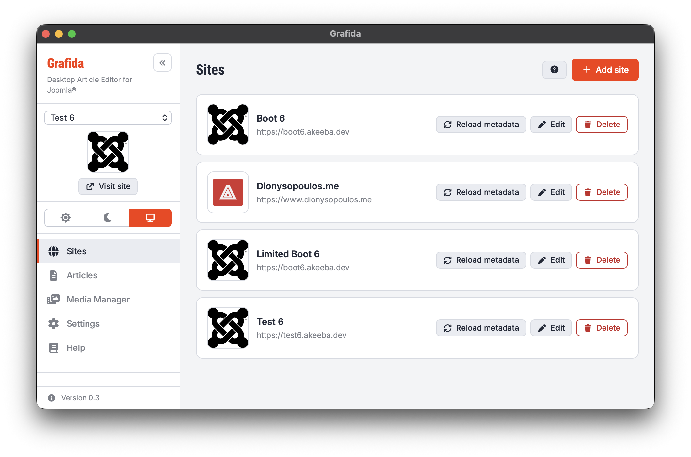

# Navigation

The left-hand sidebar, visible throughout the application, allows you to navigate through the application's various views. It also gives you handy, at-a-glance information about what you're doing. 

## Application title and collapse control

At the very top you will see the application title and subtitle. 

Next to them, you will see the collapse control button: `<<`. Click on it to collapse the navigation bar into a thin strip when horizontal screen space is at a premium.

## Site selector

Below the application title, there's the site selector area. This area is hidden when the navigation sidebar is collapsed.

The drop-down allows you to select the **active site**. This is a core part of the work you do in Grafida: the Articles and Media Manager views are shown for the site selected here.

Below that you'll see the (cached) favicon of the site, and a View Site button which takes you to the site's main page.

## Colour scheme controls

Below the site selector area you will see a tristate control for the application colour scheme. From left to right (or top to bottom, when collapsed) you have the following options:

* Light mode. Dark text on light grey background. Perfect for working outside on a sunny day.
* Dark mode. Light text on dark background. Ideal for us night owls, stricken by inspiration past midnight.
* Follow the system. Tries to follow your operating system's colour scheme preference.

The colour scheme is applied to the entire interface, including your editor. However, your site's `editor.css` may override the way the editor area looks depending on whether it is designed to be dark, light, or follow the system. To make it clear, here are the possible combinations:

| Grafida →                 | Light | Dark  | System                    |
|---------------------------|-------|-------|---------------------------|
| Dark editor.css           | Dark  | Dark  | Dark                      |
| Light editor.css          | Light | Light | Light                     |
| Follow browser editor.css | Light | Dark  | Light / Dark (OS setting) |

If your editor content area _and only that_ seems to be using the wrong colour theme, your site's `editor.css` file is the problem. Remember, we don't have control over it.

**Gotcha about the Follow The System setting**. Grafida uses a system WebView control to display itself and the editor. WebView, unlike a full browser, doesn't expose the operating system's colour scheme preference. Therefore, Grafida asks the operating system every few minutes what its colour mode is. This means that for a short amount of time after your operating system changes from light to dark (or vice versa), Grafida will display with the “wrong” colour scheme.

## Menu

Below the colour scheme controls there's the main menu of the application, with the following options:

* [Sites](Sites). Manage the sites Grafida can connect to.
* [Articles](Articles). Manage the articles and article drafts.
* [Media Manager](Media-Manager). Manage the media files uploaded to your site.
* [Settings](Settings). Change the way Grafida works. Set up LLM (AI) connectivity. 
* [Help](Help). Read the documentation built into the product.
* [Request Log](Request-Log). See the latest API calls to your site. Troubleshoot connectivity issues.

Some of these menu items may be missing, depending on the application state and your settings.

> [!TIP]
> You can go to the Settings page from anywhere in the application by holding down CONTROL (CTRL) and pressing the comma key (Windows, Linux), or holding down COMMAND (CMD) and pressing the comma key (macOS). 

Please note that the Help page displays a snapshot of the documentation for the version of the software you are using. This documentation is included in the software itself; you do not need an Internet connection to use it.

## Update notification

_Not shown in the screenshot at the top of the page_.

Below the Menu and towards the bottom of the window you will see an update notification _if there is a newer version available_. Clicking on it will take you to the download page for the latest version of Grafida. You can then download and install it. Remember to close and restart Grafida!

## Version information

At the bottom of the version you will see the version number and an info icon.

Click on it to show the “About” dialogue of the application.
