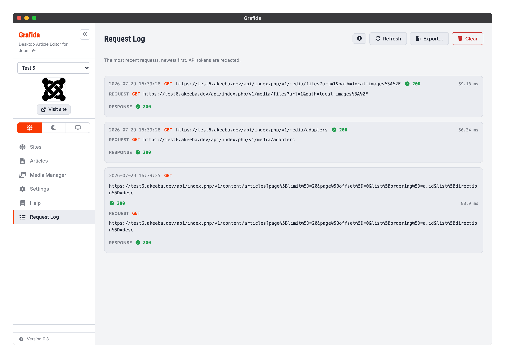

# Request Log

The Request Log records the most recent requests Grafida has sent to your site, and what came back.
It is a troubleshooting tool: when something does not work and the error message is not enough, this
is what tells you — or whoever is helping you — what actually went over the wire.

It is **off** by default. Switch it on under **Debug** in [Settings](Settings#debug); the sidebar
then grows a **Request Log** item.

## What is recorded

The last **20** requests to the active site, newest first. Each entry shows:

* the time, the HTTP method and the full URL;
* the response status and how long the request took;
* the request headers and body;
* the response headers and body.

JSON bodies are pretty-printed. A body that is not text — an image being uploaded, say — is shown
as a marker rather than as a wall of gibberish, and a very large body is truncated, with a note
saying so.

## What is not recorded

**Requests to an AI provider are not logged here.** They are not requests to your site, they can be
enormous, and they carry a different provider's key.

Nothing is written to disk. The log lives in memory for as long as Grafida is running, and it is
cleared when Grafida starts, whenever you switch to another site, and whenever you switch the
setting off. That is deliberate: it is a live window on what is happening now, not a history.

## API tokens are redacted

Your Joomla API token is masked everywhere it appears — in the `Authorization` and
`X-Joomla-Token` headers, and anywhere else it turns up in a URL or a body — down to its first four
and last four characters.

The masking happens on the one path every entry goes through, so what you see on screen is exactly
what an export contains. There is no second, laxer route out.

> [!TIP]
> The mask keeps enough of the token to tell **which** token was used, which is often the answer:
> if the first four characters are not what you expect, Grafida is using a token you thought you
> had replaced.

## The buttons

**Refresh** re-reads the log. Nothing on this screen updates by itself, so press this after
reproducing whatever went wrong.

**Export…** writes the whole log to a JSON file. Because the underlying window toolkit has no
“Save as” dialog, Grafida asks you for a **folder** and names the file
`grafida-request-log-<timestamp>.json`.

**Clear** empties the log.

> [!IMPORTANT]
> An exported log is redacted, but it still describes your site in detail: URLs, article content,
> category and user IDs. Read it before you attach it to a public bug report.

## When to use this, and when to use Diagnose Connection

The Request Log shows you what a **working, configured** site is doing. If Grafida cannot connect
to the site at all, there is nothing here to look at yet — use **Diagnose Connection** on the site's
edit dialog instead, which is described in
[Connection Troubleshooting](Connection-Troubleshooting).
