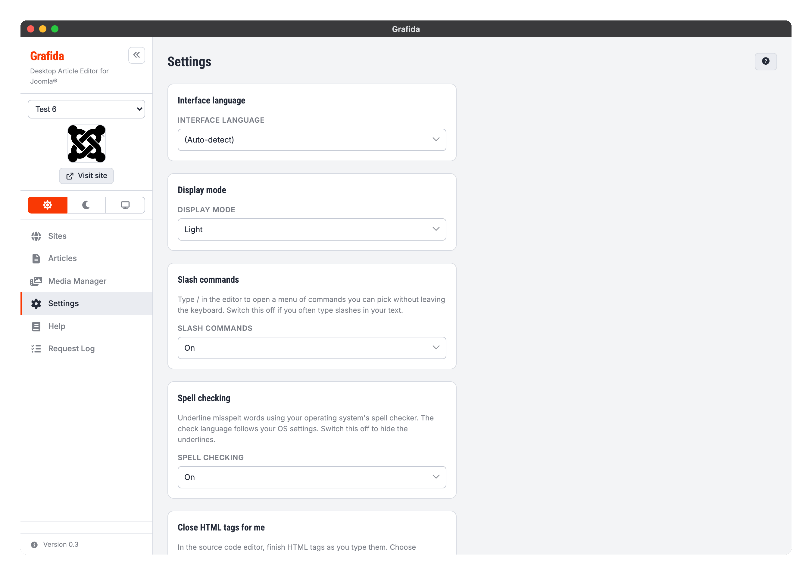
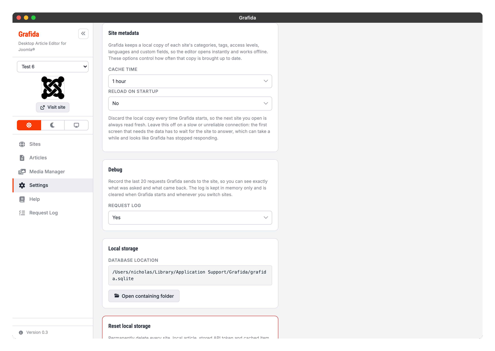

# Settings

The Settings view holds everything that applies to Grafida as a whole, rather than to one site or
one article. Settings are saved the moment you change them; there is no Save button on this page
except where one is explicitly shown.

> [!TIP]
> You can reach Settings from anywhere in the application with <kbd>Ctrl</kbd> + <kbd>,</kbd>
> (Windows, Linux) or <kbd>Cmd</kbd> + <kbd>,</kbd> (macOS).

## Interface language

The language Grafida's own interface is written in. **(Auto-detect)** follows your operating
system, falling back to English (United Kingdom) when Grafida has no translation for it.

The editor's menus and dialogs follow this setting too, where a translation exists for them.

Grafida ships English (United Kingdom), Greek, French, German, Spanish, Italian and Portuguese
(Portugal). If yours is missing, or a wording is wrong, see [Translation](Translation) — adding a
language needs no code change.

This has nothing to do with the language of the articles you write, which is set per article in the
[editor's properties sidebar](Editing-Articles#article-properties), nor with the spell-check
dictionary, which is an operating-system setting.

> [!NOTE]
> This documentation is in English only. It is a single source shared with the project's GitHub
> wiki, which has nowhere to put a translated set.

## Display mode

**Light**, **Dark**, or **Follow system**.

The same three choices are available from the switch in the sidebar, so you can change the theme
without leaving an open article. See [Navigation](Navigation#colour-scheme-controls) for what
happens to the editor's own content area, which your site's `editor.css` may override.

## Slash commands

Whether typing `/` in the editor opens the command menu. **On** by default. Switch it off if you
often type slashes in ordinary prose.

Changing this takes effect immediately, even in an editor you already have open.

## Spell checking

Whether misspelt words are underlined in the editor, using your operating system's own spell
checker. **On** by default.

> [!IMPORTANT]
> The dictionary and the language it checks against are operating-system settings that Grafida
> cannot override. See [Editing Articles](Editing-Articles#spell-checking).

Switching it off hides the underlines straight away. Switching it back **on** only marks text you
edit afterwards, not the text already on screen — an inherent limitation of the web view Grafida
draws itself with.

## Close HTML tags for me

How the [source code editor](Editing-Articles#the-source-code-editor) helps you finish HTML tags.
There are three choices rather than a simple on/off switch, because the two halves of the feature
are genuinely useful apart from each other.

**Opening and closing tags** (the default) inserts `
` the moment you finish typing `
`.

**Closing tags only** inserts nothing on its own, but completes a closing tag once you have typed
its `</`. This is the setting for editing existing markup, where tags appearing unbidden get in the
way.

**Off** leaves you to type everything.

The setting is read when the source code editor opens, so it takes effect the next time you open
it.

## Site metadata

Grafida keeps a local copy of each site's categories, tags, access levels, languages and custom
fields. That copy is what the editor and the [Articles](Articles) filters are drawn from, which is
why the editor opens instantly and works off-line. These two options control how often it is
brought up to date.

**Cache time** is how old the copy may get before Grafida quietly refreshes it in the background,
from 15 minutes to a day. **Never refresh automatically** switches the background refresh off
entirely — the **Reload metadata** buttons on the Sites, Articles and editor screens still work.

**Reload on startup** discards the local copy every time Grafida starts, so the first site you open
is read fresh from the server. It is **off** by default and should stay that way on a slow or
unreliable connection: the first screen that needs the data has to wait for your site to answer,
which looks a great deal like Grafida has stopped responding.

## Debug

**Request log** records the last 20 requests Grafida sends to your site, so you can see exactly
what was asked and what came back. It is **off** by default.

Switching it on adds a **Request Log** item to the sidebar. See [Request Log](Request-Log).

The log is kept in memory only: it is cleared when Grafida starts, whenever you switch sites, and
whenever you switch this setting off.

## Local storage

Shows where Grafida's database file lives on your computer — everything you have: sites, local
articles, unpublished pictures, cached site metadata and saved AI chats. **Open folder** opens its
containing folder in your file manager.

The file is worth including in your backups.

> [!NOTE]
> Your API tokens are **not** in that file. They are held in your operating system's own secret
> store — the macOS Keychain, the Linux Secret Service, or Windows DPAPI. See
> [Secrets security](Secrets-Security) for what that means if the file is ever exfiltrated.

## Reset local storage

**Reset local storage** permanently deletes every site, local article, stored API token and cached
item from this computer, returning Grafida to a clean, just-installed state.

> [!CAUTION]
> This cannot be undone, and there is no partial version of it. Anything you have not published is
> gone. Export the local articles you care about first —
> see [Editing Articles](Editing-Articles#moving-an-article-between-computers).

## AI Services and AI Tools

The last two cards configure the optional AI assistant, which is off until you set one up. They
have their own pages: [Overview](AI-Overview), [AI Services](AI-Services), [AI Tools](AI-Tools) and
[Chat](AI-Chat).
