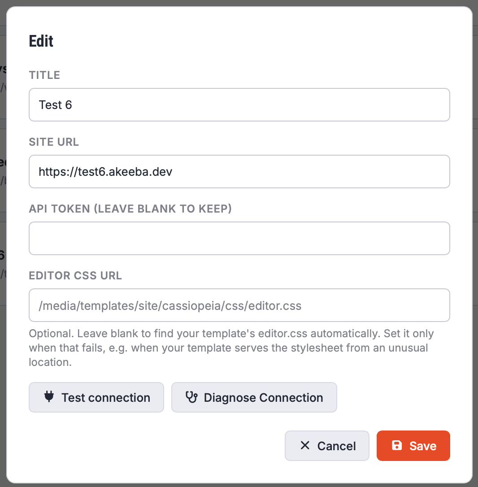

# Sites

The Sites view lets you manage the connections to the sites you can use with Grafida.

Use the **Add Site** button to add a new site.  

The **Reload metadata** button refreshes the information Grafida has cached for the site: languages, current template, categories, access levels, custom fields, and tags. You may need to use this if you were off-line for a while and things changed on the site in the meantime.

The **Edit** button lets you edit a site.

The **Delete** button deletes the site from Grafida's database along with all of its associated information.

> [!CAUTION]
> Deleting a site will permanently remove all unpublished drafts associated with this site. You cannot recover a deleted site or deleted drafts.

## Adding or editing a Site

When you add or edit a site, you see the Site's Edit dialog.

**Title**. A (short) title which makes sense to you, e.g. “Acme Blog”. It does not have to be the same as the site's title defined in Joomla's Global Configuration. Keep it short; it will be shown in the navigation sidebar's drop-down.

**Site URL**. The site's base URL, e.g. `https://www.example.com`.

If you're using a multi-language site, you will see a browser URL with the language code in it such as `https://www.example.com/en` or `https://www.example.com/index.php/en`. Do not include the language code in the Site URL field.

**API Token**. Your personal Joomla API Token.

When editing a site, the API Token is shown blank. This is an intentional security measure. Leave it blank to keep the same API Token. However, if you want to use the Test Connection or Diagnose Connection button, you will need to reenter it.

**Editor CSS URL**. The path relative to the site's root for the `editor.css` file which will be loaded in the article editor.

In most cases you can leave it empty. 

If you are not a Super User and / or your site is using a non-standard path for its template's media files **AND** you want your editor in Grafida to use the same text styling used across your site you will need to enter the relative path to the `editor.css` or equivalent file on your site, e.g. `media/custom_stuff/editor.css`. You can read more about this file and how it's used in Joomla co-founder [Brian Teeman's blog](https://brian.teeman.net/joomla/876-improve-the-joomla-content-editor).

You can use the **Test Connection** button to check that the Site URL and API Token you have entered work properly.

If the connection fails, click on **Diagnose Connection**. See [Connection Troubleshooting](Connection-Troubleshooting) for more information.
